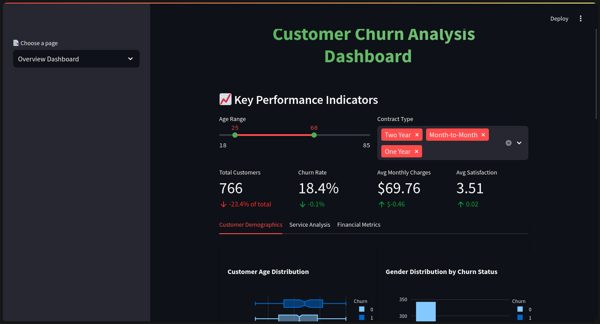

# 🔄 Customer Churn Analytics Platform

An enterprise-grade analytics platform that empowers businesses to understand, predict, and prevent customer churn through advanced data analytics and machine learning.

## 📊 Dashboard Preview



## Dataset

This project uses the IBM Telco Customer Churn dataset, which includes:
- 7043 customers
- 21 features
- Real telecom service usage
- Actual churn behavior

Source: [IBM Sample Data Sets](https://raw.githubusercontent.com/IBM/telco-customer-churn-on-icp4d/master/data/Telco-Customer-Churn.csv)

## ✨ Core Features

### Analytics & Insights

- **Customer 360° View** - Comprehensive customer behavior analysis
- **Real-time KPIs** - Monitor critical metrics:
  - Churn Rate Trends
  - Customer Lifetime Value (CLV)
  - Satisfaction Scores
  - Revenue Impact
- **Interactive Visualizations** - Dynamic charts and graphs powered by Plotly

### 🤖 Predictive Analytics

- **ML-Powered Churn Prediction**
  - Random Forest classifier with optimized parameters
  - Feature importance analysis
  - Cross-validation metrics
- **Risk Scoring System**
  - Individual customer risk assessment
  - Segment-level risk analysis
  - Early warning indicators

### 🎯 Customer Segmentation

- **Advanced Clustering**
  - K-means segmentation
  - 3D visualization of segments
  - Behavioral patterns analysis
- **Segment Profiling**
  - Detailed segment characteristics
  - Migration analysis
  - Revenue contribution

### 💡 Smart Recommendations

- **Personalized Actions**
  - Customer-specific retention strategies
  - Service upgrade suggestions
  - Risk mitigation plans
- **Segment-level Strategies**
  - Targeted marketing recommendations
  - Product bundle suggestions
  - Engagement improvement plans

## 🛠️ Technical Architecture

### Technology Stack

- **Frontend**: Streamlit
- **Analytics**:
  - Pandas & NumPy for data processing
  - Scikit-learn for machine learning
  - Plotly for visualizations
- **Configuration**: YAML-based settings
- **Logging**: Python's logging module

### Project Structure

```
test/
├── src/
│   ├── analytics/           # Analytics components
│   │   ├── clv_analyzer.py
│   │   ├── engagement_analyzer.py
│   │   ├── recommendation_engine.py
│   │   └── risk_scorer.py
│   ├── pages/              # Dashboard pages
│   │   ├── overview.py
│   │   ├── detailed_analysis.py
│   │   ├── prediction.py
│   │   └── segmentation.py
│   ├── config.py           # Configuration management
│   ├── data_loader.py      # Data handling
│   ├── data_processor.py   # Data preprocessing
│   ├── model.py           # ML models
│   └── visualization.py    # Visualization utilities
├── app.py                  # Main application
├── config.yaml             # Configuration file
└── requirements.txt        # Dependencies
```

## 🚀 Getting Started

### Prerequisites

- Python 3.8+
- pip package manager

### Installation

1. Clone the repository

```bash
git clone [repository-url]
cd ChurnAI-Dashboard
```

2. Set up virtual environment

```bash
python -m venv venv
source venv/bin/activate  # Windows: venv\Scripts\activate
```

3. Install dependencies

```bash
pip install -r requirements.txt
```

4. Launch the application

```bash
streamlit run app.py
```

## 💻 Usage Guide

### 1. Overview Dashboard

- View high-level KPIs and trends
- Filter data by various parameters
- Export summary reports

### 2. Detailed Analysis

- Deep dive into customer behaviors
- Analyze service usage patterns
- Investigate churn factors

### 3. Prediction System

- Get individual customer predictions
- Understand risk factors
- Generate recommendations

### 4. Customer Segmentation

- Explore customer segments
- Analyze segment characteristics
- Track segment evolution

## ⚙️ Configuration

Configure the application through `config.yaml`:

```yaml
data:
  filename: "customer_churn.csv"
  categorical_columns: [...]
  numerical_columns: [...]

model:
  target: "Churn"
  test_size: 0.2
  n_estimators: 100
  max_depth: 10

visualization:
  color_scheme: [...]
  chart_theme: "plotly_white"
```

## 📈 Performance Metrics

- Model Accuracy: ~98.30%
- Prediction Speed: <1000ms
- Data Processing: Up to 1M records
